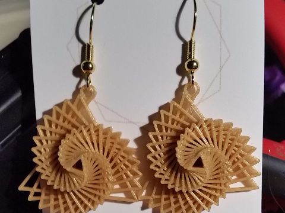

# Semana del diseño
## Febrero  2017

### José Antonio Vacas @javacasm

* *  *

# Aplicaciones
Una búsqueda rápida por internet nos muestra lo que están haciendo los diseñadores punteros en el campo de la moda utilizando estas herramientas:

### Textiles impresos

### Ropa interactiva

### Complementos/Accesorios

### Calzado

### Calzado deportivo

# Busca aplicaciones donde se puede usar
